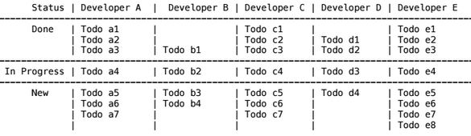

## Project Management (Rails and Backbone)

- In small organization project manager generally work with multiple projects, multiple teams, team member.
- Often it happens, he misses out some of the minute details like who is working on what at current point of time.
- Also sometime it may happen,in a day some team members are too busy but some are free.
- The application will help project manager in creating a todo list for project and help to show status of system at any given point of time.
    1. Application is having well defined authentication system
    2. Application is having well defined authorization system
    3. System has only two roles
        1. Admin(Project Manager)
        2. Developer
    4. As Admin
        1. He/She should be able to create a project
        2. He/She should be able to create a todo for project (e.g "Design database for feature X")
        3. He/She should be able to assign a todo to developer
        4. He/She should be able to add developer to project (Note: Project can have many developer and developer can have many projects)
    5. As Developer
        1. He/She should be able to see a todo list for him.
        2. He/She should be able to mark is 'in progress' or 'Done'.
    6. On Admin's dashboard (After login page)
        - At any given point of time he will see a list of all developer list with todo in following format.

        

#### Sample Data
##### Admin
    hari@promobitech.com
##### Developers
    arnab@promobitech.com
    abhishek@promobitech.com
    rana@promobitech.com
    jalendra@promobitech.com
    
The Application has been deployed on [Heroku](https://project-management-rishi.herokuapp.com)

#### Future Enhancements
- Admin can create project, todos and assign todo to specific developer
- Developer can change status for todo to `In Progress` or `Done`
